# BalloonRange · 墙面气球靶场

第一人称定点射击训练场：站在靶场里，打对面墙上的气球。

原生 Windows 程序，**C++ / Win32 / 固定管线 OpenGL**，**零第三方依赖** —— 除了系统自带的
几个 DLL 和 Visual Studio 的编译器，不需要装任何东西，也不需要任何图片、音频素材文件
（画面里的字形、音效全部在代码里生成）。

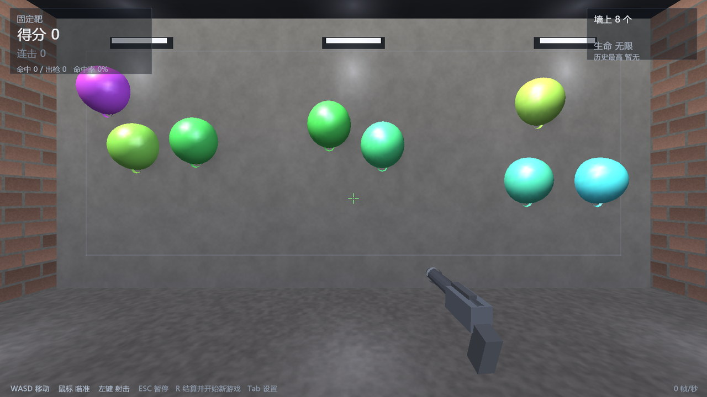

---

## 目录

- [特性](#特性)
- [快速开始](#快速开始)
- [操作](#操作)
- [设置面板](#设置面板)
- [八套预设方案](#八套预设方案)
- [界面一览](#界面一览)
- [可调参数（44 项）](#可调参数44-项)
- [命令行](#命令行)
- [内置自检](#内置自检)
- [项目结构](#项目结构)
- [实现要点](#实现要点)
- [已知限制](#已知限制)

---

## 特性

- **八套预设方案**，从"墙上八个不动的球"到"永远只有一个小球、打空即结束"，一套一个玩法。
  预设只是一组参数值，套上之后**每项都能继续手调**。
- **44 项可调参数**，分两页八组，改一项立刻生效；面板右侧一栏随时解释光标底下那一项是干什么的。
- **"邻位生成"落位算法**：打掉一颗后，新球落在幸存那颗周围一个可调的环带里，
  按面积均匀取点，且绝不会落在刚被打掉的位置上（"跟踪训练"这套预设用的就是它）。
- **近 20 局历史记录**，带每局的完整成绩，落盘保存，关掉程序再打开还在。
- 四类气球（普通 / 小快 / 金球 / 慢球）、四种墙面（抹灰 / 砖 / 瓷砖 / 混凝土）、四种准星样式。
- **音效全部由代码合成**（击破音带音高变体、漏球音、界面音、结算音），
  按目标位置做左右声道差与距离衰减，不需要任何 `.wav` 素材。
- **关掉设置面板就自动存档**，下次启动自动读回；参数与成绩存成三个带 CRC 的二进制文件。
- **内置 3572 条自检断言**（`--selftest`），不开窗口、不碰 OpenGL，在没有桌面的机器上也能跑到底。
- 支持**离屏出图**（`--shot=xxx.png`），用来做回归对比；出图模式下既不读也不写存档。

---

## 快速开始

### 直接运行

编译好的程序在 `bin/BalloonRange.exe`（578,560 字节，约 565 KB）。双击即玩，不需要安装、不需要运行库。

它会自己在同目录生成三个存档文件（`记录.dat` / `历史.dat` / `参数.dat`），删掉等于清档。

### 自行编译

需要有 Visual Studio（用到它自带的 `cl.exe`）。项目根目录下：

```
build.bat            →  bin\BalloonRange.exe      release，日常用这个
build.bat debug      →  bin\BalloonRange_d.exe    debug，带断言，排障用
build.bat clean      →  清掉 bin\ 与 obj\ 里的中间产物（不动存档）
```

构建脚本自己找编译器：先看顶部的 `VSROOT`（若该目录存在就直接用，也方便一台机器上装了好几个
Visual Studio 时指定用哪一个），不存在就调用 `vswhere` 取最新的、带 C++ 生成工具的安装位置 ——
所以装完 Visual Studio 一般什么都不用改。只有在自动探测不合意时，才需要手工把 `VSROOT`
指到含有 `VC\Auxiliary\Build\vcvars64.bat` 的那个目录。

链接的系统库只有 `opengl32 / glu32 / user32 / gdi32 / shell32 / winmm`，
全部随 Windows 附带。

---

## 操作

| 按键 | 作用 |
|---|---|
| `W` `A` `S` `D` | 前后左右移动（越不过地上那条警戒线） |
| 鼠标 | 转视角（点击画面锁定光标） |
| 鼠标左键 | 射击；设了「连射间隔」之后按住可以连发 |
| `Esc` | 暂停 / 继续。结算屏、设置面板、历史记录屏上按它不会有任何反应 |
| `R` | 游戏中、暂停中：结算本局并直接开始新一局；结算屏：开始新一局 |
| `F` | 只在结算屏：翻看最近 20 局的成绩 |
| `Tab` | 打开 / 关闭设置面板 |

打爆一个气球得分，分数随气球变小、连击变长而提高；漏球扣不扣命、扣不扣分由当前预设决定。

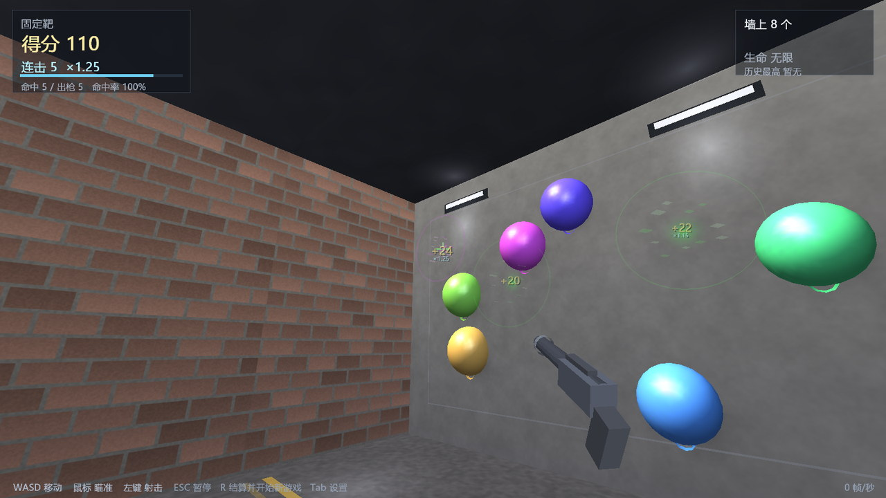

---

## 设置面板

`Tab` 打开的就是那张参数表本身。标题栏下面是一条**菜单栏**，把参数分成**两页**：

```
┌────────────────────────────────┬──────────────────────────┐
│  设置                            预设方案设置 · 第 1 / 33 项│
│  ▍预设方案设置   用户偏好设置 ←菜单栏（左右切换）            │
│  ▍当前预设方案：        固定靶 ▶│  选项说明                │
│    气球                         │  当前生效的预设方案。    │
│    数量                    8 个│  全部玩法参数与某一套    │
│    最大半径             0.40 米│  预设完全一致时显示该    │
│    最小半径             0.40 米│  方案名，否则显示        │
│    …                            │  「自定义参数」。        │
│  ↑↓：选择  ←→：调整  …          │                          │
│  Tab：关闭                      │                          │
└────────────────────────────────┴──────────────────────────┘
```

| | 预设方案设置页（第一页） | 用户偏好设置页（第二页） |
|---|---|---|
| 装什么 | 第 0 行「当前预设方案」+ 32 项玩法参数 | 12 项偏好参数（玩家 / 画面 / 声音） |
| 会被预设方案覆盖吗 | **会**（整页都被覆盖） | 不会 |
| `回车` | 在第 0 行**展开预设弹窗** | **不做事**（这一页没有第 0 行） |
| `R` | **不做事** | **把这 12 项恢复为出厂默认**（玩法参数一项都不动） |

**菜单栏**：打开面板时光标停在栏上；`←` `→` 切页，`↓` 回列表，`Home` 跳到本页最后一行。
进栏有三条路，效果一样：在列表第一行再按 `↑`、**按住 `↑` 不放直到走到顶**、或者任何时候按 `Home`。

| 按键 | 菜单栏上 | 预设页第 0 行 | 参数行 | 预设弹窗里 |
|---|---|---|---|---|
| `↑` `↓` | `↑` 不做事；`↓` 回列表 | 选择 | 选择（按住可快速连翻；在第一行按 `↑` 会进菜单栏） | 选择（到顶 / 到底就停住，不绕圈） |
| `←` `→` | 切换分类 | 什么都不做（这一行没有数值） | 调整选中项 | 什么都不做 |
| `回车` | 什么都不做 | 展开预设弹窗（光标落在当前那一套上） | — | 确认光标那一套，随之自动收起 |
| `Home` | 什么都不做 | 跳到首行 | 跳到首行 | 跳到首行 |
| `End` | 跳到本页最后一行，同时离开菜单栏 | 跳到末行 | 跳到末行 | 跳到末行 |
| `R` | 只在偏好页生效 | 不做事 | 同左 | — |
| `Esc` | 什么都不做 | 什么都不做 | 什么都不做 | 只收起弹窗，面板还开着 |
| `Tab` | 关闭面板 | 关闭面板 | 关闭面板 | 关闭面板 |

几个约定：

- **页脚只写"现在真的能按"的键。** 光标停在哪一态，页脚就只出现那一态能用的键 ——
  回车只属于第 0 行与弹窗，`R` 只属于偏好页，按了不反应的键不出现在页脚上。
  方向一律写成 `↑↓←→`，不写"上下左右"。
- **面板与历史记录屏只认方向键**：`W`/`A`/`S`/`D` 在这几个界面里什么都不做。
- **第 0 行那串字是实时算出来的**：把当前参数拿去和八套预设逐套比，只比那套预设管得着的项；
  全部相同就显示那一套的名字，否则显示「自定义参数」。手改任何一项它立刻变，改回原样自己变回去。
- **`←` `→` 调值时，开关与枚举项会绕圈**（到头上从另一头接上），
  **带滑动条的项不绕圈**（到端点停住）。
- **边调边生效**。只有生命、时限、随机种子三项要下一局才生效。
- **关掉面板就自动存档**，写的是全部 44 项，落在 exe 同目录的 `参数.dat`；
  打开看一眼就关掉不算改过，不会去动存档文件。
- 列表里上 / 下还有内容时会出现 `︿` / `﹀` 两个箭头，**各占一个真实的选项位**：
  窗口装得满就不给箭头让格，装不满才让。按下 `↓`，光标在屏幕上的位置只往下走、绝不倒退。

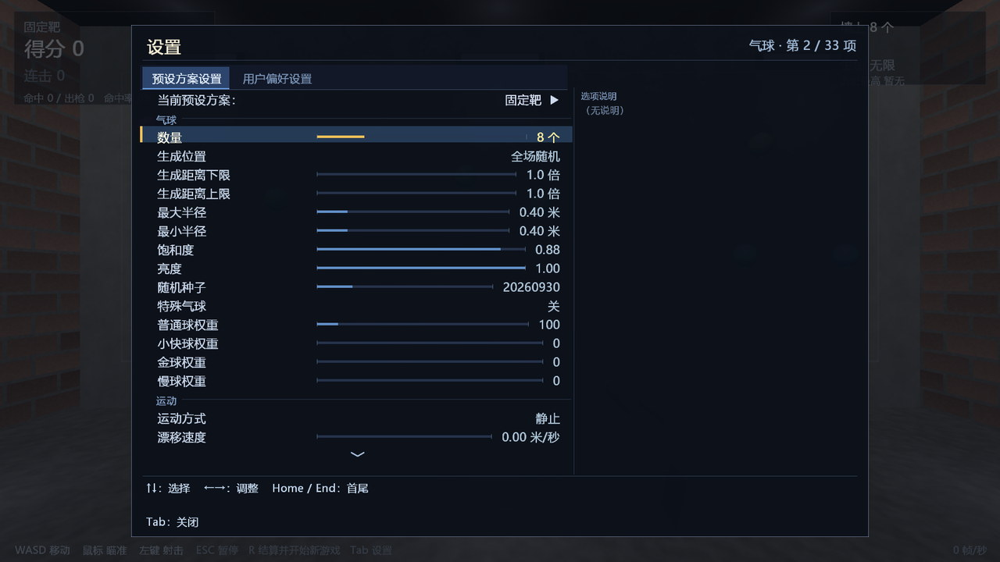

**历史记录**（结算屏按 `F`）：排版与设置面板同一个模板，左边一列可选的行，右边一栏成绩表。
第 1 次就是最近打完的那一局，只留最近 20 局。只有 `F` 能关这一屏。

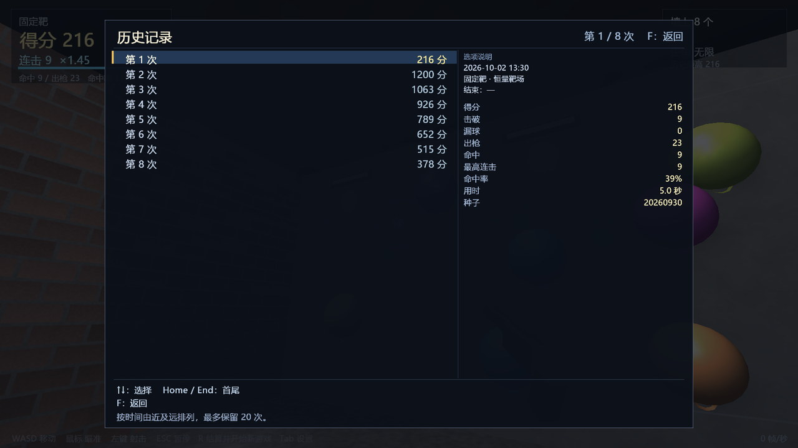

---

## 八套预设方案

预设方案 = 一组提前写好的可玩参数。面板第 0 行按回车展开弹窗，选一套再按回车确认。

| # | 预设 | 怎么玩 |
|---|---|---|
| 0 | **固定靶**（默认） | 墙上 8 个一样大的球，一动不动。打掉一个立刻补上，没有时限、无限生命。熟悉准心和鼠标手感用。 |
| 1 | **移动靶** | 球左右漂移、上下轻微起伏，大小随机。练跟枪。 |
| 2 | **小快靶** | 球又小又快，还会突然跳到别处，出现动画很短。练预判和提前量。 |
| 3 | **跟踪训练** | 墙上**只有 2 个球**，都在原地不动、不消失。打掉一个，新球出现在剩下那颗周围 **2R~4R 的环带**里（R 为气球半径，范围可在面板上改），但**绝不会生成在刚被打掉的位置上**。练"眼睛跟着新出现的位置走、手跟上去"的反应速度。 |
| 4 | **计时挑战** | 90 秒内尽可能多打。球会漂移，3.5 秒没打掉就飞走并扣一条命。按住左键可连发。 |
| 5 | **渐进训练** | 墙上 3 个球、5 条命，球跑了扣命。每过 30 秒整体变快一档、球也变小一点。 |
| 6 | **混合靶场** | 12 个球里混着小快球、金球和慢球，分值各不同。练取舍：先打哪个。 |
| 7 | **精准挑战** | 墙上永远只有一个小球，判定严格到贴着球面。打空一次这一局就结束。 |

命令行上也能直接指定：`--preset=0..7`。

### 「跟踪训练」的落位规则

新球的圆心落在这么一个区域里：

- 以幸存那颗球的圆心为中心画一个**环带** —— 内径 = 两球半径之和 ×「生成距离下限」，
  外径 = 两球半径之和 ×「生成距离上限」；
- 半径方向按**面积均匀**取一个值（外圈面积大，所以落在外圈的机会本来就更多）；
- 角度方向在这个半径的**可用弧**里按弧长均匀取一点。

**可用弧** = 整圈，先掐掉"新球会越出墙面"的弧，再掐掉"新球会压到刚被打掉那颗"的弧。
掐是**精确减弧**，不是"撒点试几次、不行重来"—— 只要还剩一条弧就一定能取到点，
没有"运气不好试不出来"这条路。因为是连续取角，斜着相邻是常态而不是例外。

默认 1.0~2.0 倍、等径 0.40 米时，两球半径和是 0.80 米，于是**圆心距 ∈ [0.80, 1.60] 米 = [2R, 4R]**。

贴到墙边时可用弧会变短（四角上可能只剩一条窄缝），但**绝不会生成到墙外**；
这时候落点是"环带 ∩ 出球区 − 死球圆盘"这块区域里按面积取的点，贴墙时也是均匀的。
参数被调到极端、一点都放不下时走一条兜底路径：先保"不出墙"，距离范围让位。

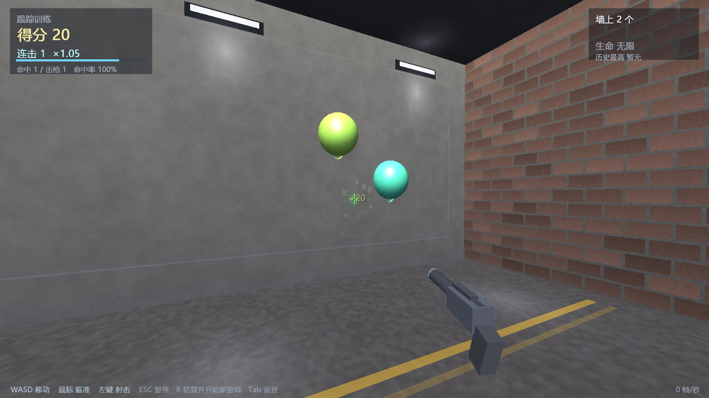

---

## 界面一览

下面这些图全部由 `--shot` 离屏渲染生成 —— 固定步长、固定随机种子，同一组参数拍出来逐字节一致；
参数见[命令行](#命令行)。每组两张，先左后右。

### 玩法与预设

 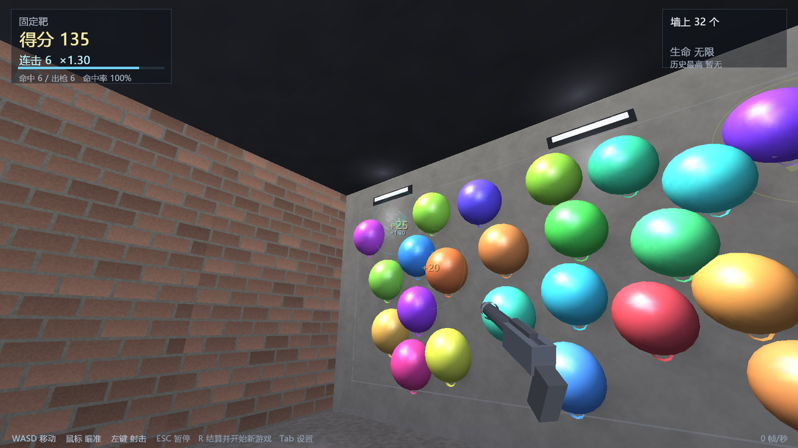

*左：击破瞬间，准星旁飘出得分，右上角记着连击。右：压力测试，墙上同时挂 32 个球。*

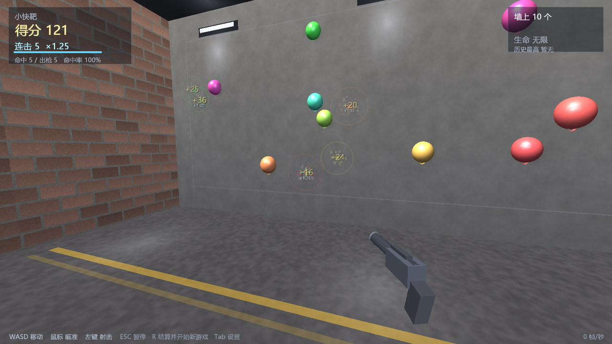 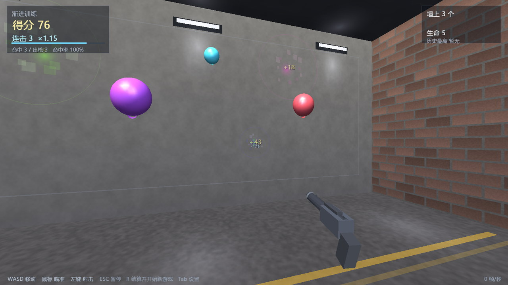

*左：「小快靶」，球小、漂得快、分值高。右：「渐进训练」，每过 30 秒整体变快一档、球也小一点。*

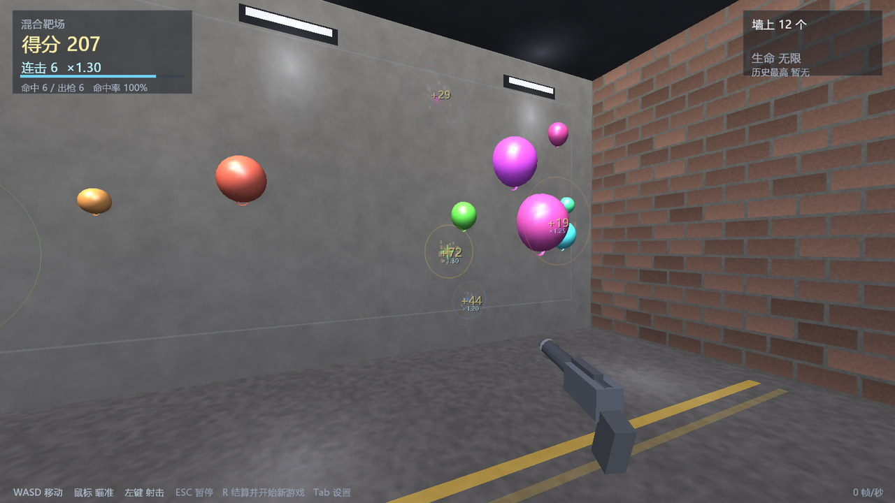 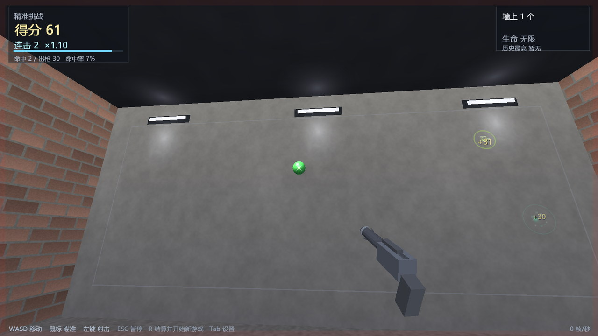

*左：「混合靶场」，12 个球里混着四类气球，分值各不同。右：「精准挑战」，墙上只有一个小球，打空一次即结束。*

### 跟踪训练

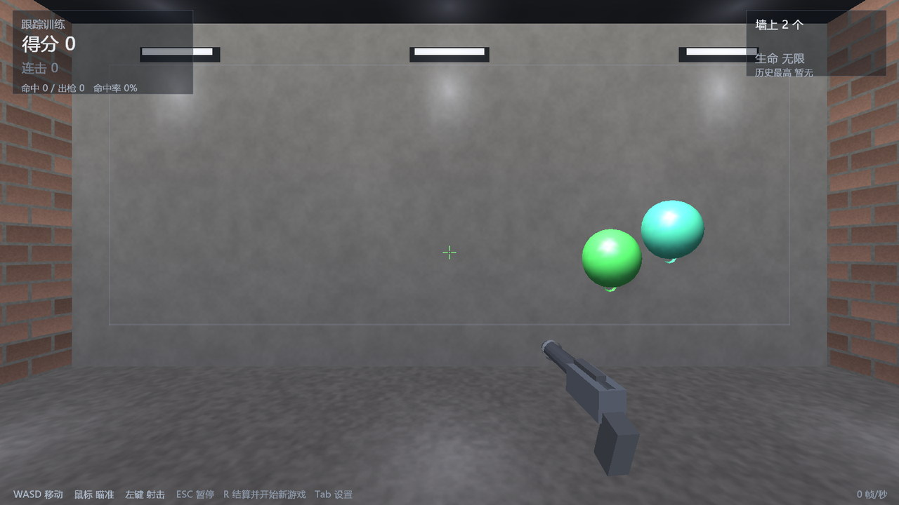 

*左：开局，墙上恒为两颗固定靶。右：打掉一颗后的补位 —— 新球落在幸存那颗周围 2R~4R 的环带里，不在刚被打掉的位置上。*

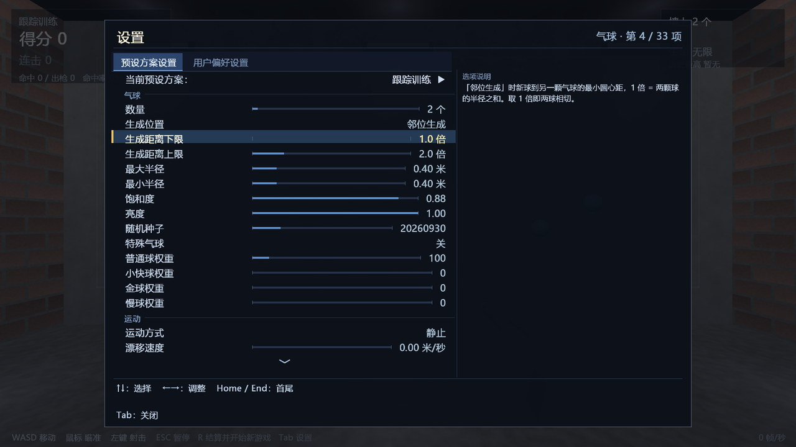

*环带范围可以在面板上直接改：「生成距离下限 / 上限」，单位是两球半径之和。*

### 墙面

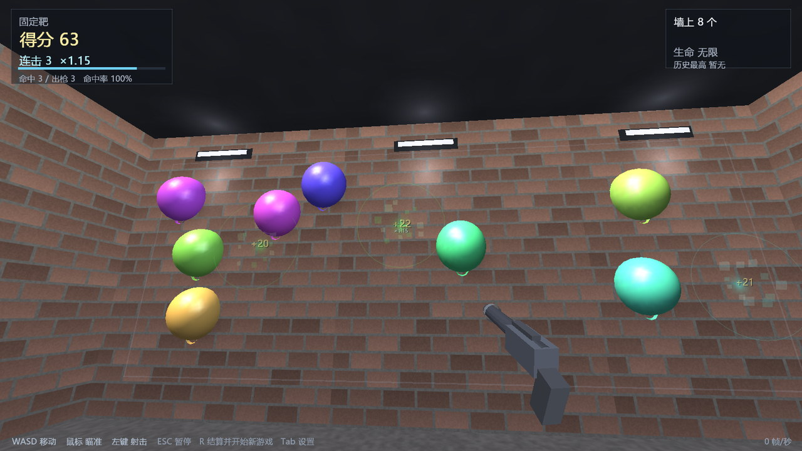 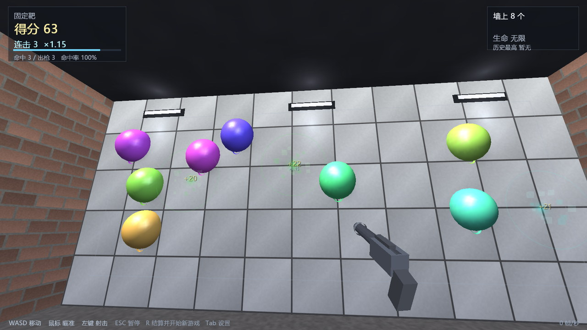

*砖墙与瓷砖墙。四种墙面风格在面板的「墙面风格」一项里切换，默认是抹灰墙（见文首那张）。*

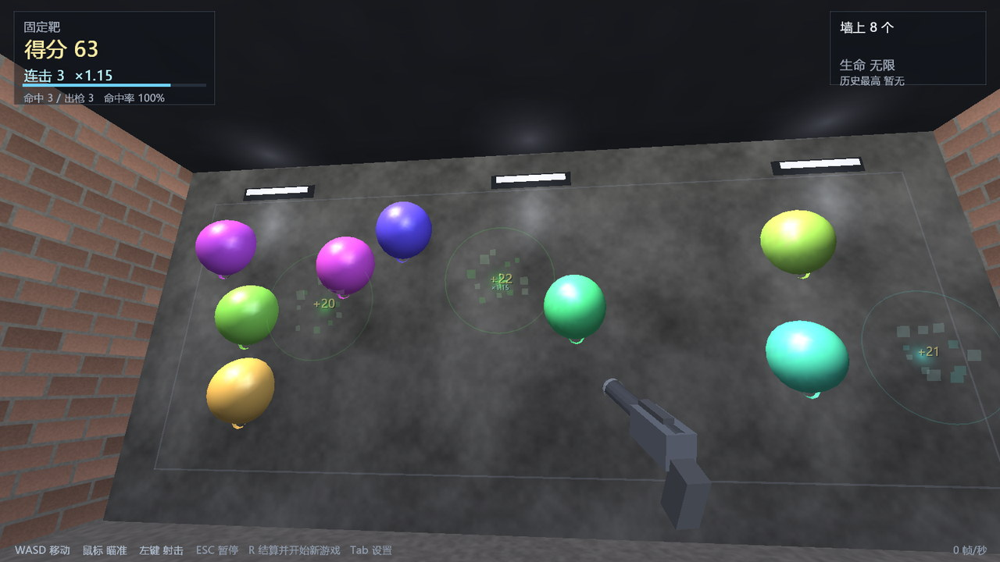

*毛坯混凝土墙。*

### 屏幕状态

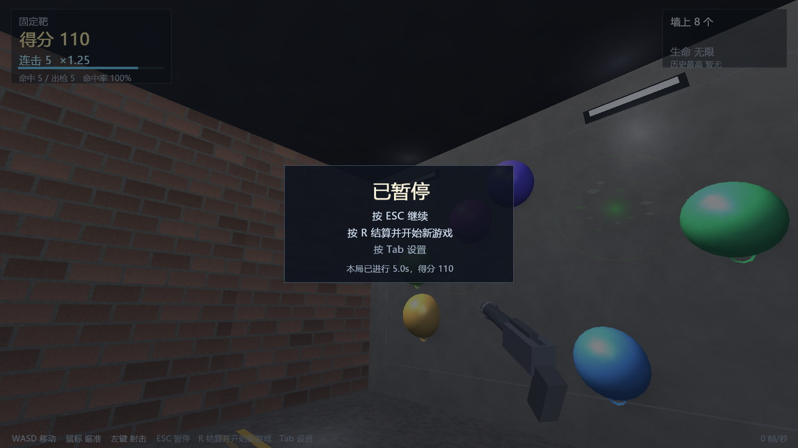 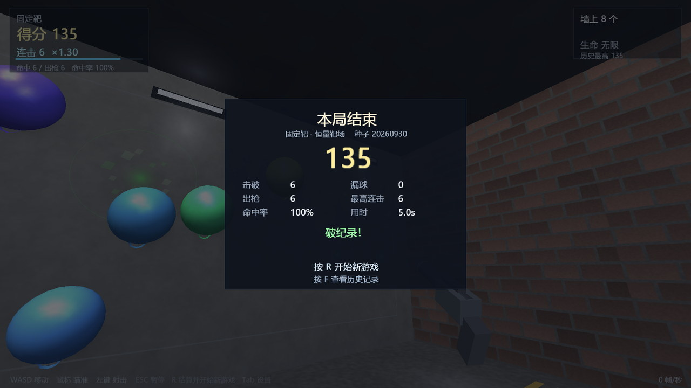

*左：暂停屏。右：结算屏，列出本局成绩并标出有没有刷新纪录。*

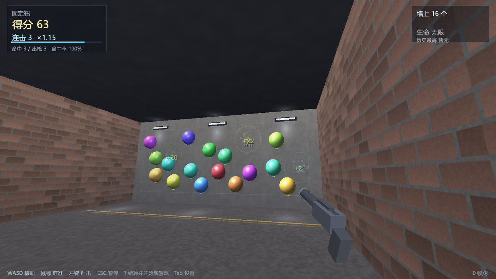 

*左：退到靶场角落时的视野，能看见远处墙上的球与地上的警戒线。右：历史记录屏，最近 20 局的完整成绩。*

### 设置面板

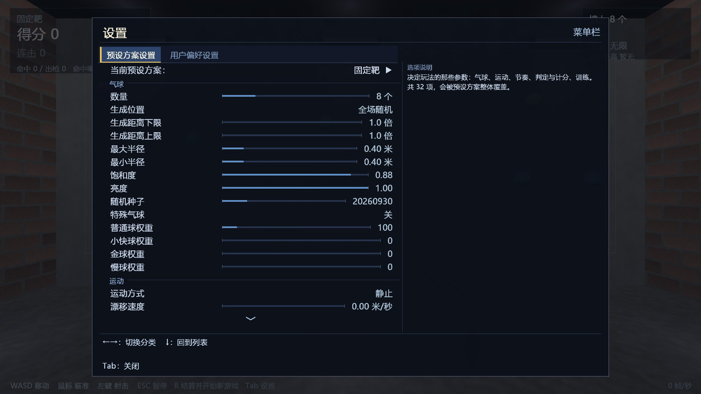 

*左：菜单栏展开（`↑` 从列表顶部进入）。右：预设方案设置页 —— 第 0 行是当前预设，下面 32 项玩法参数，右侧一栏解释光标底下那一项。*

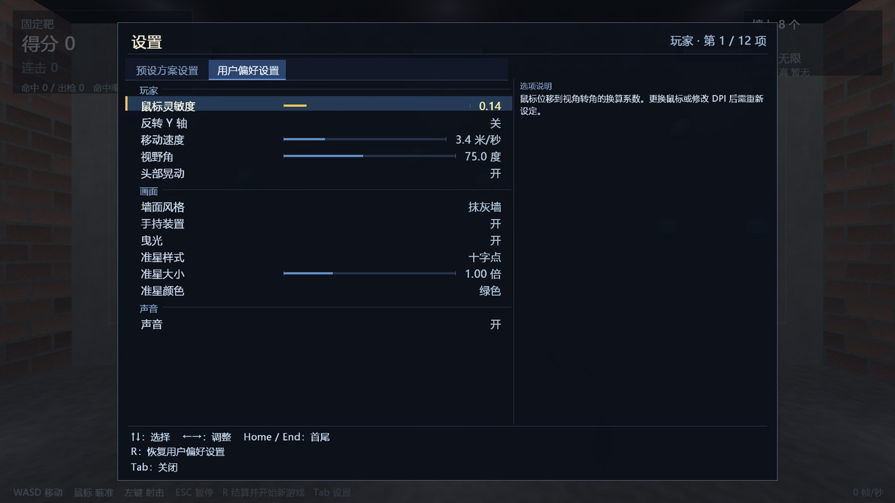

*用户偏好设置页，12 项与玩法无关的显示 / 操作偏好。*

---

## 可调参数（44 项）

| 大类 | 组 | 项数 | 内容 |
|---|---|---|---|
| **预设方案设置** | 气球 | 14 | 数量、**生成位置**、**生成距离下限 / 上限**、最大 / 最小半径、饱和度、亮度、随机种子、特殊气球、四类球权重 |
| | 运动 | 5 | 运动方式、漂移速度、漂移幅度、浮动幅度、浮动频率 |
| | 节奏 | 5 | 存活时限、漏球扣命、补位延迟、出现动画、连射间隔 |
| | 判定与计分 | 4 | 判定宽容、连击窗口、计分基准、漏球断连击 |
| | 训练 | 4 | 初始生命、时限、无限生命、统计面板 |
| **用户偏好设置** | 玩家 | 5 | 鼠标灵敏度、反转 Y 轴、移动速度、视野角、头部晃动 |
| | 画面 | 6 | 墙面风格、手持装置、曳光、准星样式 / 大小 / 颜色 |
| | 声音 | 1 | 声音（开 / 关） |

其中 39 项写了说明，另外 5 项是一看就懂的名字，有意留空。说明文字全部是客观陈述句。

**「生成位置」**是个两项开关：`全场随机`（默认）在出球区里均匀撒点；
`邻位生成` 让新球围着墙上剩下的那颗球生成 —— 「跟踪训练」用的就是它。

**「生成距离下限 / 上限」**只在「生成位置」= `邻位生成` 时起作用，
单位是**倍**，1 倍 = 两颗球的半径之和，取值范围 1.0 ~ 6.0。
下限 = 上限时环带退化成一根圆；下限 > 上限时程序自动对调（与「最大半径 / 最小半径」同一套规矩）。

---

## 命令行

```
bin\BalloonRange.exe --show                  开窗口进游戏
bin\BalloonRange.exe --selftest              跑全部断言，不开窗口、不碰 GL
bin\BalloonRange.exe --shot=a.png            离屏渲染一帧写成 PNG 之后退出
bin\BalloonRange.exe --help                  全部选项
```

常用开关：

| 选项 | 说明 |
|---|---|
| `--preset=N` | 套用第 N 套预设（0 起） |
| `--n=` `--wall=` `--fov=` `--move=` `--lifetime=` `--hitforgive=` | 覆盖单项参数（在预设之后生效） |
| `--spawndist=下限,上限` | 覆盖「邻位生成」的圆心距范围，单位 = 两球半径和，如 `--spawndist=2,4` |
| `--frames=N` | 出图前先推进 N 个固定步长 |
| `--fire=N` | 前 N 步里自动瞄准开火，让截图真的走过一遍拾取与计分 |
| `--pose=x,y,z,yaw,pitch` | 指定站位与朝向 |
| `--panel --panel-page=0\|1 --panelsel=N --panel-menu` | 出图前把设置面板摆出来，指定停在哪一页、哪一行、或留在菜单栏 |
| `--panel-keys=36,35,38,40,13` | 打开面板后真的注入这些虚拟键码，走的是程序真实的输入路径 |
| `--screen=0\|1\|2\|3` | 出图前切到 游戏中 / 暂停 / 结算 / 历史记录 |
| `--hist-fill=N` | 出图前垫 N 条合成历史记录（只进内存，不落盘） |
| `--atlas=x.png` | 导出字形图集并自校验 |
| `--dump-sfx=目录` | 把合成的音效导出成 wav |

**出图是只读的**：只要带 `--shot`，程序就既不读也不写三个存档文件，
同一组参数拍出来的图永远一样，也不会把你自己的成绩和调好的参数拍没了。

---

## 内置自检

```
> bin\BalloonRange.exe --selftest
[selftest] pass=3572 fail=0
[自检] 全部通过。
```

3572 条断言分成 41 组，覆盖参数面板的状态机、存档往返、落位算法的分布、
界面文案、字形图集、音效合成等等。逐条明细写进 `bin\selftest_report.txt`（UTF-8）。

几类值得一提的做法：

- **分布断言**：落位算法不是"跑一跑看着对"，而是击破几千次统计圆心距分布、
  按等面积分档做卡方检验、逐条断言"禁区里的样本数必须是 0"。
- **前提断言**：行为断言最容易的失败方式是循环一次都没进去、恒真全绿。
  所以每一组关键断言旁边都配一条"这种情形真的跑到过"的前提断言。
- **文案对账**：界面上画出去的每一行字，拼起来必须和源码里的原文一字不差，
  对不上就按 `[hud] 警告` 报出来 —— 自动折行算错会静默换字，光看代码看不出来。
- **绘制层哨兵**：`[panel] 警告` 盯着"状态全对、画面全白"这类故障
  （绘制循环提前退出、列表底边越过页脚），这类错误写不出状态断言，只能让它在绘制时自己喊。
- **反向验证**：每条关键断言都用"注入 bug → 确认变红 → 撤回 → 确认变绿"跑过一遍，
  证明它真的管得住那段代码，而不是一条恒绿的空话。

所有这些都**不开窗口、不碰 OpenGL**。

---

## 项目结构

```
BalloonRange/
├── build.bat          一键构建（MSVC，纯 ASCII，见文件内注释）
├── src/               17 个 .cpp + 17 个 .h
│   ├── main.cpp       入口、命令行、主循环
│   ├── core.*         时间步长、随机数、数学
│   ├── config.*       44 项参数、8 套预设、说明文案、存档格式
│   ├── scene.*        场景与墙体
│   ├── balloon.*      气球池与落位算法
│   ├── player.*       玩家状态与移动
│   ├── input.*        键盘 / 鼠标输入与长按节拍
│   ├── effect.*       弹跳、飘分等特效
│   ├── score.*        计分与成绩簿
│   ├── history.*      最近 20 局历史
│   ├── hud.*          字形图集与全部界面文案
│   ├── app.*          界面状态机、设置面板
│   ├── render.*       全部绘制与文字排版
│   ├── texture.*      PNG 加载、纹理上传
│   ├── png.*          自写 PNG 编码（出图用，零依赖）
│   ├── audio.*        音效合成、混音、waveOut 播放
│   └── selftest.cpp   3572 条断言
├── screenshots/       界面截图
└── bin/               产物目录（编译后生成；预编译的 exe 也在这里）
```

---

## 实现要点

**渲染**。固定管线 OpenGL 画 3D 场景，二维界面用正交投影叠加。界面上的汉字不依赖任何字体文件：
启动时用 GDI 把需要的字逐个画进位图，拼成一张字形图集纹理，之后全部按纹理坐标绘制 ——
所以整个程序没有任何素材文件，一个 exe 就是全部。

**音效**。四种音效（击破、漏球、界面、结算）都是运行时代码合成的：
正弦与噪声经过包络整形，击破音额外做 13 个半音变体，同一个音效随机取一个，听感不重复。
播放走 `waveOut`，按目标位置算左右声道差与距离衰减，做出伪 3D 声像。

**存档**。三个二进制文件（`记录.dat` 每套预设的最高分、`历史.dat` 最近 20 局、
`参数.dat` 全部 44 项），各自带 magic 与版本号，记录带 CRC。
参数结构体只往末尾追加字段，旧档读回来时新字段取默认值，老档不会因为程序升级而失效。
读不懂的档一律当"没有记录"处理，**不删文件**。

**设置面板**。面板是个状态机（菜单栏 / 列表 / 预设弹窗），绘制规则和输入规则共用同一套
"行 → 屏幕格位"的换算，只保留一个坐标来源，避免两处各算一套而慢慢漂开。
滚动按"格"锚定：一格 = 行高，窗口起点记在格上，因此按住 `↓` 时光标的屏幕位置只会往下走。

**出图与回归**。`--shot` 提供离屏渲染，固定步长、固定随机种子，
所以同一组参数拍出来的图逐字节一致，可以直接拿 md5 做回归对比。出图模式下存档路径被显式清空。

---

## 已知限制

- **Windows only**。用到了 Win32 窗口、GDI 字形生成、`waveOut` 与固定管线 OpenGL。
- **编译需要 Visual Studio**（`cl.exe`）。仓库里带了编译好的 exe，不编译也能玩。
- 用任务管理器**强杀进程会丢掉本局改过的参数**（正常关面板、正常退出都会保存）——
  这是"关面板即写盘"与"不频繁写盘"之间取的一个折中。
- 历史记录只保留最近 20 局，第 21 局会把最旧的一条挤掉。
- 设置面板与历史记录屏**只接受键盘操作**，不支持鼠标点击。
- 截图里`25_历史记录`右栏的时间戳是从"现在"往前推的，所以那张图重出时那几个字会变，
  其余截图与时刻无关。
